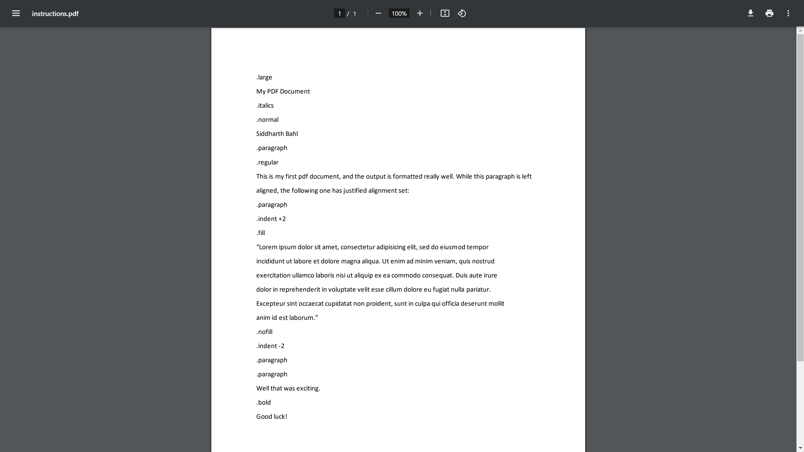
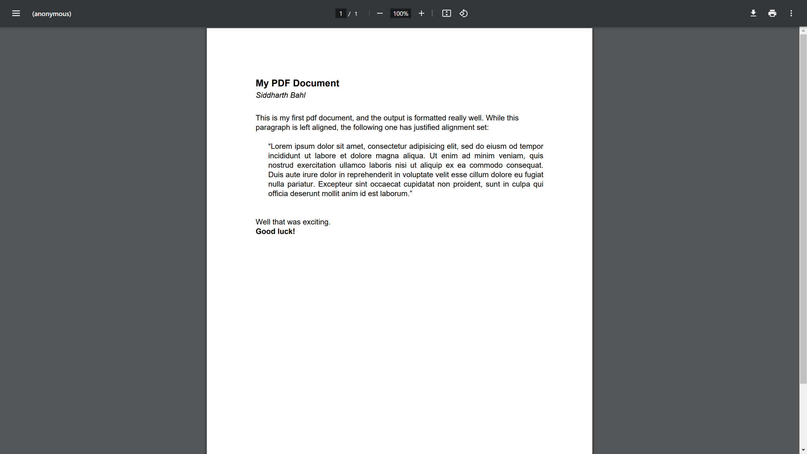
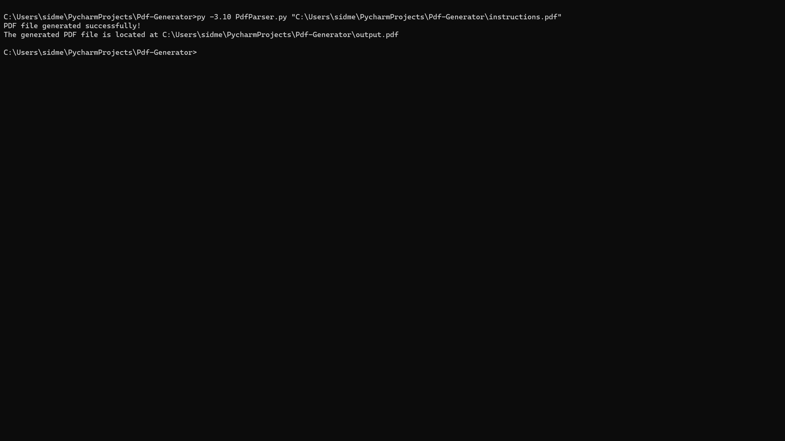

## Information
This code is used to generate a formatted PDF File from an input PDF File containing text formatting 
commands along with the text itself.  

This is carried out through various Python libraries such as,  
1.> `PyPDF2` to read the text from the input PDF File.  
2.> `ReportLab` to write to and add the formatted content to the output PDF File.  
3.> Other libraries such as `os` and `sys` to print the output file path and get the 
command line argument. 

## Egample
If the input PDF File is as follows,

We get a formatted output PDF File, such as,

## Running the Code
To run the code, go to the root folder of `Pdf-Generator/` from the command line and
run the `PdfParser.py` file using Python. Running from the command line you will also 
have to add the input PDF File's path as an argument.

Running the code from the command line,

Upon the successful generation of the output file, a success message will be printed 
along with the output file's path

`Note:- I have already provided a sample input PDF file called 
instructions in the root folder`
